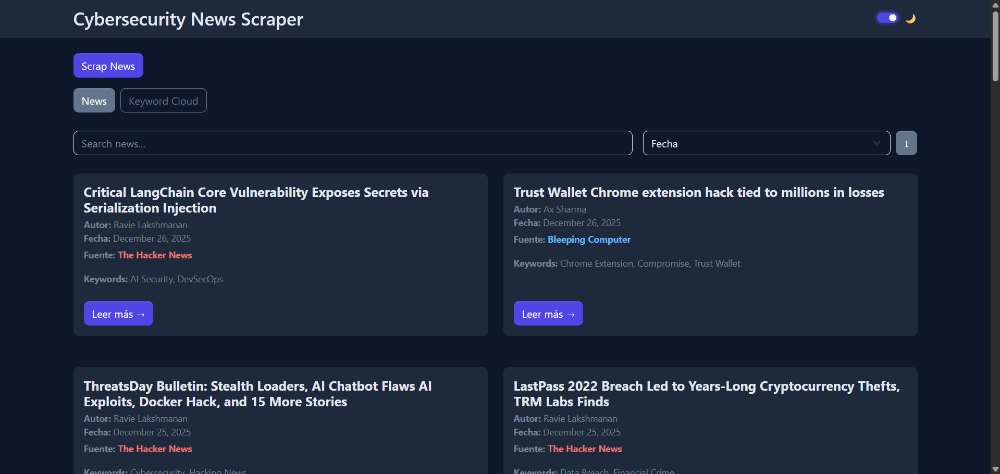
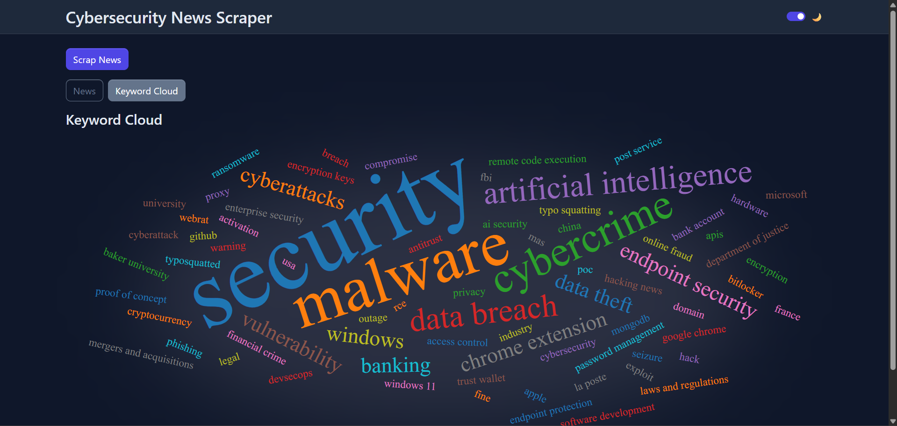

# Cybersecurity News Scraper

This project consists of an application that scrapes cybersecurity news from different open sources. It is composed of a frontend and a backend that communicate via REST API. The code structure of this project is modular, allowing new sources to be added and new functionalities to be integrated with minimal effort.

## Usage

### Docker

The easiest way to run the application is using Docker. First, copy environment template:

```bash
cp .env.example .env
```

Optionally, customize ports in `.env` file:
```
BACKEND_PORT=3000
FRONTEND_PORT=3001
```

Build and start containers:
```bash
docker compose up --build
```

The application will be available at:
- Backend: `http://localhost:3000` (or your configured `BACKEND_PORT`)
- Frontend: `http://localhost:3001` (or your configured `FRONTEND_PORT`)

To stop the containers:
```bash
docker compose down
```

### Manual setup

#### Instalation

To prepare the project for running, you must use the following commands in the backend:
```bash
npm install
npx playwright install
```

And for the frontend:
```bash
npm install
```

#### Development

For running in development phase, use the following command in the backend:
```bash
npm run dev
```

And for the frontend:
```bash
npm run build
```

#### Production

For production, you must first build the backend and the frontend with this command:
```bash
npm run build
```

After that, you can run both the frontend and the backend, with the following command:
```bash
npm start
```

The *port 3001* is configured as the default port for the frontend, which fetchs the data from the *port 3000* of the backend.

## Gallery

List of scraped news:


Keywords cloud of the scraped news:
