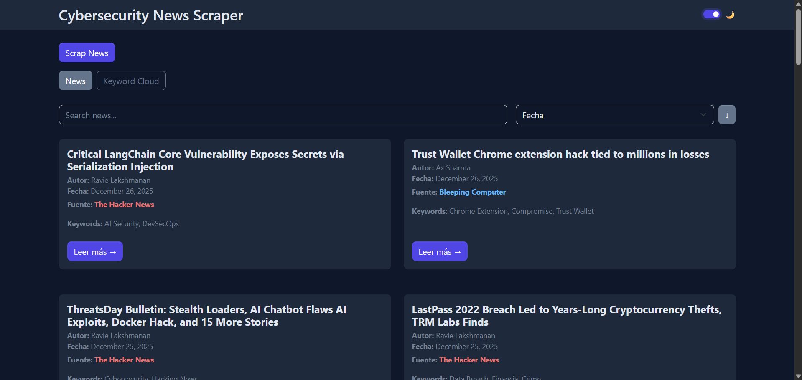
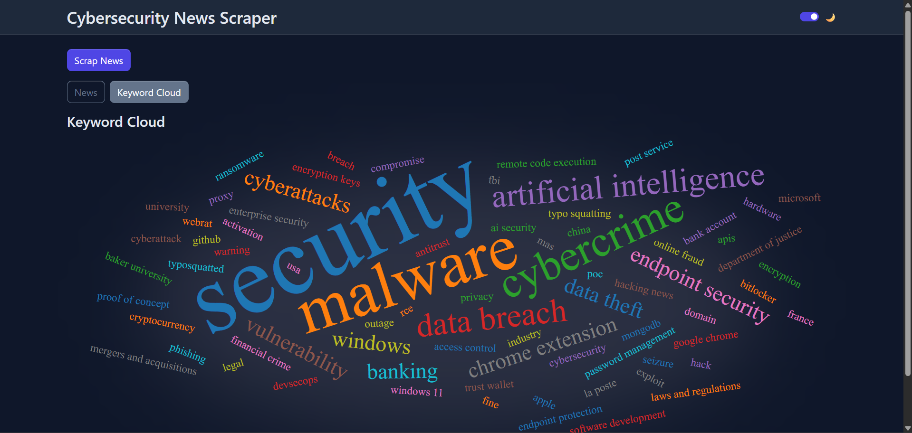

# Cybersecurity News Scraper

This project consists of an application that scrapes cybersecurity news from different open sources. It is composed of a frontend and a backend that communicate via REST API. The code structure of this project is modular, allowing new sources to be added and new functionalities to be integrated with minimal effort.

## Usage

### Docker

The easiest way to run the application is using Docker. First, copy environment template:

```bash
cp .env.example .env
```

Build and start containers:

```bash
docker compose up --build
```

To stop the containers:

```bash
docker compose down
```

### Manual setup

#### Development

To prepare the project for running, you must use the following commands in the root directory of the project:

```bash
npm install
npx playwright install
```

For running in **development** phase, use the following command:

```bash
npm run dev
```

#### Production

Install the dependencies with the following commands:

```bash
npm ci
npx playwright install
```

For **production**, you must first build the packages with this command:

```bash
npm run build
```

After that, you can run the application with the following command:

```bash
npm start
```

## Configuration

The application can be configured using environment variables defined in the `.env` file. It will be avaible in `localhost` at the configured ports:

```
BACKEND_PORT=3000
FRONTEND_PORT=3001
```

## Gallery

List of scraped news:


Keywords cloud of the scraped news:

