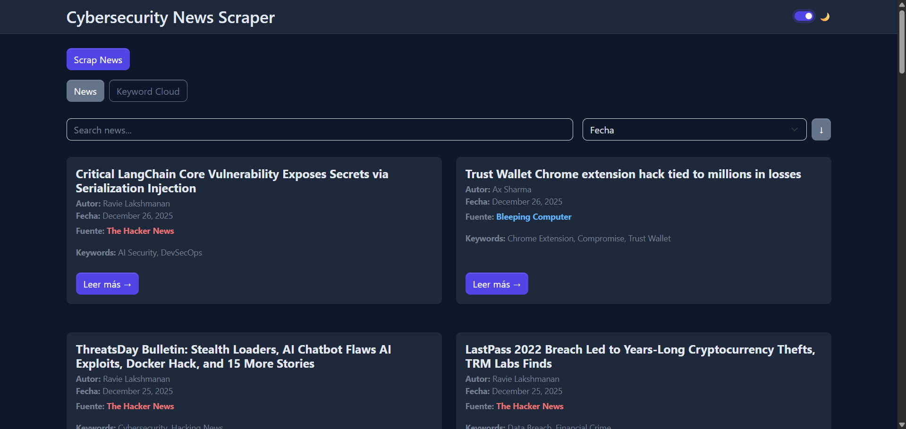
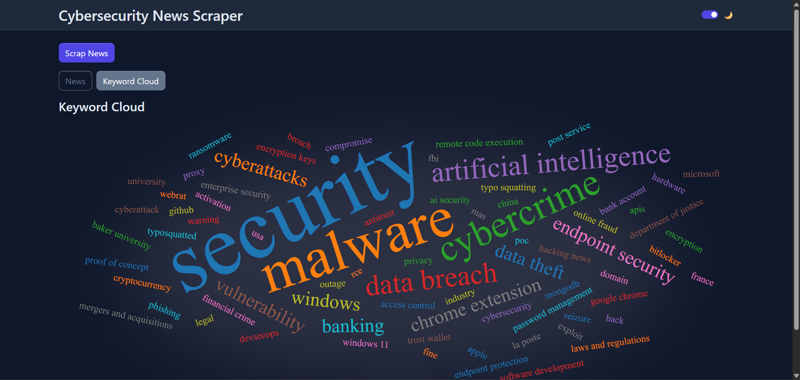

# Cybersecurity News Scraper

This project consists of an application that scrapes cybersecurity news from different open sources. It is composed of a frontend and a backend that communicate via REST API. The code structure of this project is modular, allowing new sources to be added and new functionalities to be integrated with minimal effort.

## Usage

### Development (Dev Container)

The recommended way to develop is using **VS Code Dev Containers**. The Dev Container provides a fully configured environment with Node.js, Playwright browsers, and all project dependencies — no local setup required.

#### Prerequisites

- [Docker Desktop](https://www.docker.com/products/docker-desktop)
- [VS Code](https://code.visualstudio.com/) with the [Dev Containers](https://marketplace.visualstudio.com/items?itemName=ms-vscode-remote.remote-containers) extension

#### Windows Users & Hot-Reload

When running Docker on Windows, file system events (`inotify`) across Windows host mounts (`C:\...`) are not natively propagated to Linux containers. Choose one of the following options:

- **Option A — WSL2 Linux Filesystem (Recommended):**
  Clone the repository inside the WSL2 home directory (`/home/<user>/...`):

    ```bash
    # From a WSL2 terminal (e.g. Ubuntu)
    cd ~
    git clone https://github.com/Oscar-SR/cybersecurity-news-scraper.git
    code cybersecurity-news-scraper
    ```

    Docker, the filesystem, and VS Code share the same Linux kernel, enabling native `inotify` and instant hot-reload with zero polling.

- **Option B — VS Code Container Volume (Fastest setup without WSL CLI):**
  Open VS Code on Windows, press `F1` / `Ctrl+Shift+P`, and select:

    > **Dev Containers: Clone Repository in Container Volume...**

    Paste the repository URL (`https://github.com/Oscar-SR/cybersecurity-news-scraper.git`). VS Code will clone the repo into an isolated Docker volume with native Linux performance and instant hot-reload.

#### Getting started

1. Copy the environment template (production):

    ```bash
    cp .env.example .env
    ```

    _(Optional)_ If you need custom development settings (e.g. `PROXY_PORT` or `WATCH_POLLING`):

    ```bash
    cp .devcontainer/.env.example .devcontainer/.env
    ```

2. Open the project in VS Code and run **Dev Containers: Reopen in Container** from the command palette (`Ctrl+Shift+P` / `F1`).

3. Once inside the container, start both dev servers:

    ```bash
    npm run dev
    ```

4. The application is available at `http://localhost:3001` (or your custom `PROXY_PORT`) through the Caddy reverse proxy.

Any file changes you make in VS Code are immediately detected:

- **Backend** (`packages/backend/src/`): `nodemon` restarts the Node.js process.
- **Frontend** (`packages/frontend/src/`): Vite applies Hot Module Replacement (HMR) in the browser.

#### SonarQube (optional)

A SonarQube service is available behind a Docker Compose profile. To start it alongside the Dev Container:

```bash
docker compose -f .devcontainer/docker-compose.yml --profile sonarqube up -d sonarqube
```

SonarQube will be available at `http://localhost:9000`.

### Production

#### Docker deployment

Production images are built locally from Dockerfiles (`packages/backend/Dockerfile`, `packages/frontend/Dockerfile`).

To deploy:

```bash
npm run docker:deploy
```

To stop:

```bash
npm run docker:down
```

> Production requires `DOMAIN` and `EMAIL` in `.env` (Caddy uses them to obtain and auto-renew Let's Encrypt certificates).

To deploy manually on a VPS:

```bash
# SSH into the VPS, pull latest code and build+deploy
git pull
docker compose up -d --build
```

### Manual setup (without Docker)

#### Development

```bash
npm install
npx playwright install
npm run dev
```

#### Production

```bash
npm ci
npx playwright install
npm run build
npm start
```

## Configuration

### Production (`.env` in root)

| Variable | Description                             | Default             |
| -------- | --------------------------------------- | ------------------- |
| `DOMAIN` | Domain name for Caddy HTTPS             | `example.com`       |
| `EMAIL`  | Email for Let's Encrypt SSL certificate | `admin@example.com` |

### Development (`.devcontainer/.env`)

| Variable     | Description                                 | Default |
| ------------ | ------------------------------------------- | ------- |
| `PROXY_PORT` | Port exposed by Caddy reverse proxy on host | `3001`  |

## Gallery

List of scraped news:


Keywords cloud of the scraped news:

